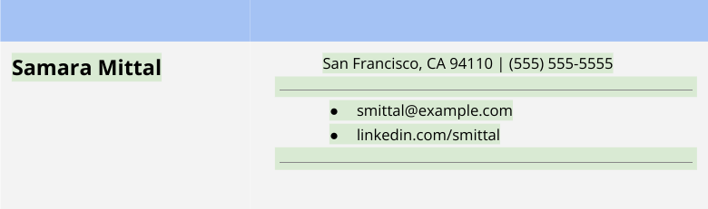
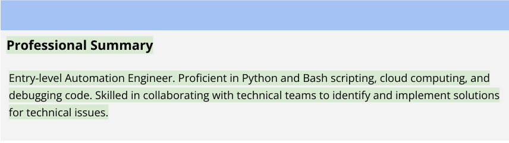
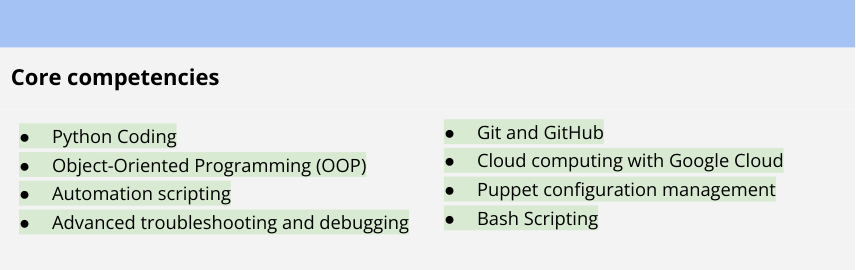

# Tailor your resume

As you prepare for your job search, you will need to create or update your resume to reflect your experience in order to apply for roles like:

Automation Engineer

Entry-level Python Developer

IT Support Specialist II

Entry-level Software Engineer

Network Engineer

## Tailor the content

Identify what is important to the potential employer. What does the employer want to know about you? Make sure that you carefully read the job description and notice which skills are mentioned. You can also read several job descriptions for the same type of role to identify which skills and requirements show up frequently. For instance, although specifics will vary by role and employer, many Python automation-related roles require the ability to effectively organize and coordinate across teams and projects, manage multiple tasks simultaneously, and communicate effectively. You should take note of these skills and be sure to highlight them using similar terms on your resume.

Create one primary resume to edit and tailor to each job application. You should make sure that the order of your skills and qualifications matches the job description. In doing this, you are making sure that the things that are most important to the employer are at the top.

Match the language used in the job description. Some employers use automation software to filter resumes. If the job description uses keywords like cloud services and risk management, make sure your resume uses those keywords, too.

Use Python automation terminology. This will help the hiring manager reading your resume understand how your past experience is relevant to the role for which you are applying.

Decide what not to include on your resume. You may have some skills that are important to you, but those same skills may confuse or distract the hiring managers reading your resume.

Highlight how your experience and skills are relevant to the job. If you have been working as an IT Support Specialist but want to become a Python Automation Engineer, your troubleshooting skills will be essential in your new role. Make sure to point out how those skills will be beneficial to the employer.

## Choose an appropriate format

No matter what layout or template you choose for your resume, there are several things you should keep in mind

The design of your resume should be simple and easy to understand for both human and artificial intelligence readers. You don’t want your resume to be discarded before a real person has a chance to read it!

Your resume should be easy to read and communicate all of the important information in short bullet points.

Your resume should be one to two pages long and contain only the last ten to fifteen years of relevant experience. It is appropriate to use two columns on a one-page resume, but if your resume is two pages, be sure to use the entire width of the page.

## Update the relevant sections

Once you have determined the appropriate format for your resume, you will need to update each of your resume’s major sections, which include:

Contact information

Professional summary

Core competencies

Professional experience

Education and certifications

**Pro tip:** Resumes should be written in the third person and should not contain personal pronouns.

Let’s discuss how to incorporate your new skills into these sections of your resume.

### Contact information

Your header should contain your contact information and should go at the top of your resume.

Your header should include the following information:

Your name in a larger font than the rest of your resume

The city and state you live in (you do not need to include your street address for privacy purposes)

Your phone number and a link to your email address

Link to your LinkedIn profile URL

Links to any other personal websites or portfolios, if applicable to the role you are applying for

Your header should be relevant, simple, and easy to read. Here is an example of a resume header:

### Professional summary

Below your header, include a professional summary.

Use your summary to set the tone. Your summary should be one to three lines and should clearly state why you are the best candidate for the position. It should showcase the most important things you want the reader to know about you. If you are applying for a new role, you will want to update your industry specialty. You likely have experience that can be related to critical thinking and complex problem solving. You will want to incorporate that relevant experience into your new professional summary. Make sure you tailor your description of yourself to the role you are applying for.

Merge the description of the role you are applying for with your experience. Here is an example:

Automation Engineer with two years of demonstrated success in complex problem solving. Skilled in cross-functional collaboration and project execution. Articulate communicator who thrives in a results-driven collaborative environment.

Use keywords from the job description to describe yourself. If the job description states that the company is looking for a candidate with knowledge of cloud computing, Linux, or Bash scripting, you should add that to your resume—you have gained that knowledge with this certification.

Once you have your professional introduction, your next sentence should describe how your unique expertise will make you valuable to the employer.

**Pro tip:** Don’t forget to use this section to highlight something that makes you stand out from other applicants. Use an accomplishment from a previous role to show the employer what you can offer them. Take a look at this example of a professional summary section:

### Core competencies

Your core competencies should be a bulleted list of the most relevant skills applicable to the position you are applying for.

**Pro tip:** Scan the job description for core competencies you have gained during this certification and your past experience then use those skills as bullet points in this section. Make sure to keep this section relatively short, with four to eight bullets. Here is an example of a Python Automation Engineer resume core competencies section:

### Professional experience
